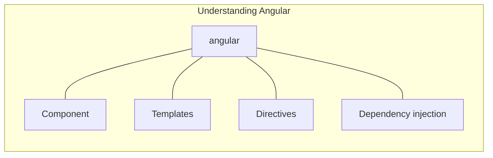
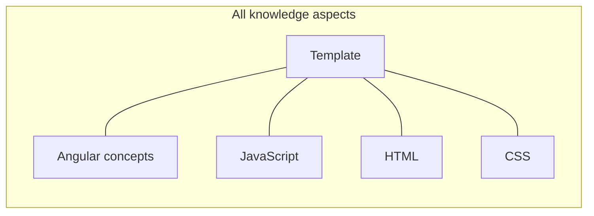

      

  
  To understand the capabilities of the Angular framework, you need to learn about the following

  # Components
  # Templates
  
      In Angular, a template is a blueprint for a fragment of a user interface (UI). Templates are written in HTML, and special syntax can be used within a template to build on many of Angular's features.
      can be seen as Enhancing HTML

      Angular extends the HTML syntax in your templates with additional functionality.For example, Angular’s data binding syntax helps to set Document Object Model (DOM) properties dynamically.
      
      

   (event)="statement"<br>
   Use template statements with elements, components, or directives in response to events<br>
   Responding to events is an aspect of Angular's unidirectional data flow. You can change anything in your application during a single event loop.<br>
```
<button type="button" (click)="deleteHero()">Delete hero</button>
```
  ## Syntax
  Like template expressions, template statements use a language that looks like JavaScript. However, the parser for template statements differs from the parser for template expressions. In addition, the template statements parser specifically supports both basic assignment (=) and chaining expressions with semicolons (;).

The following JavaScript and template expression syntax is not allowed:

.new<br>
.Increment and decrement operators, ++ and --<br>
.Operator assignment, such as += and -=<br>
.The bitwise operators, such as | and &<br>
.The pipe operator<br>
 ## Statement context
 Statements can refer only to what's in the statement context <br>
```
<button type="button" (click)="onSave($event)">Save</button>
<button type="button" *ngFor="let hero of heroes" (click)="deleteHero(hero)">{{hero.name}}</button>
<form #heroForm (ngSubmit)="onSubmit(heroForm)"> ... </form>
```
In this example, the context of the $event object, hero, and #heroForm is the template context names take precedence over component context names
  # Directives
  # Dependency injection

