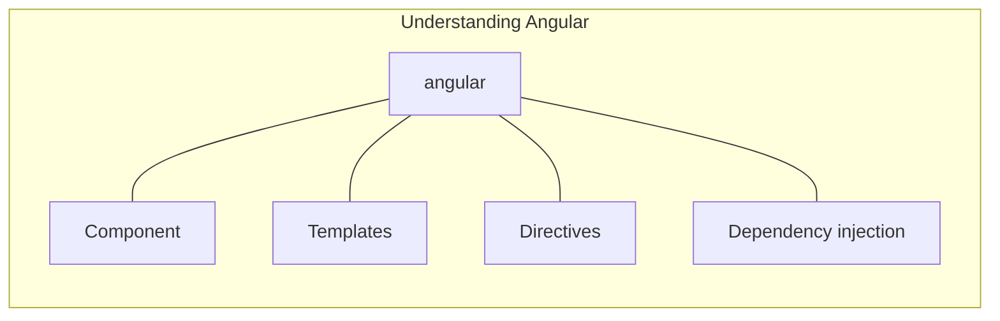
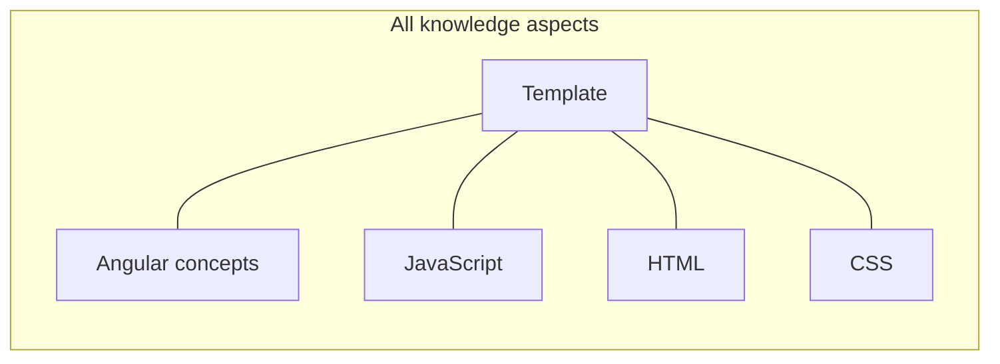

      

  
  To understand the capabilities of the Angular framework, you need to learn about the following

  # Components
  # Templates
  
      In Angular, a template is a blueprint for a fragment of a user interface (UI). Templates are written in HTML, and special syntax can be used within a template to build on many of Angular's features.
      can be seen as Enhancing HTML
      

  # Directives
  # Dependency injection

